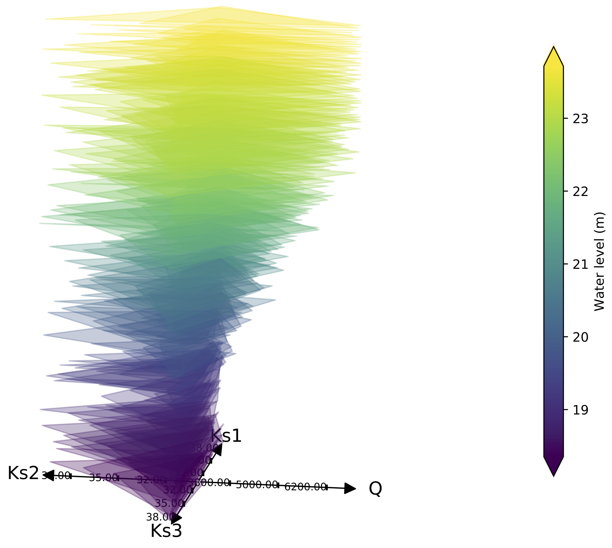
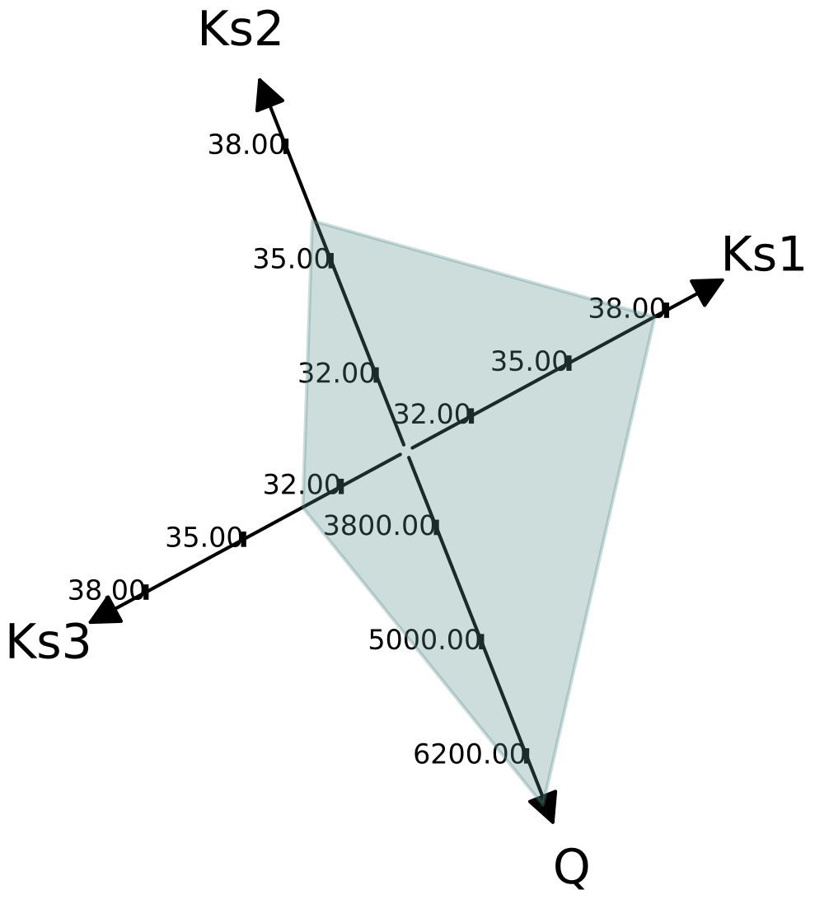
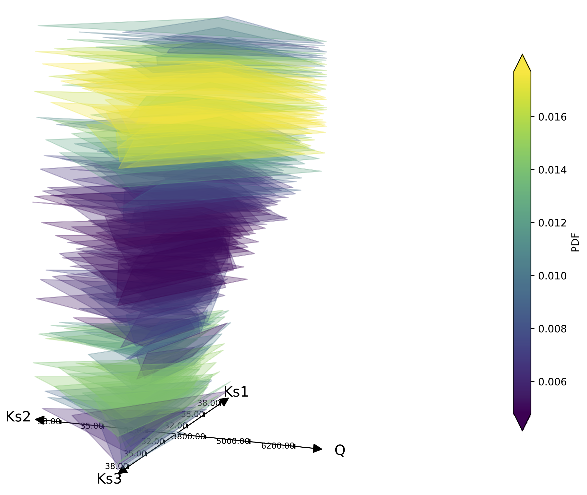
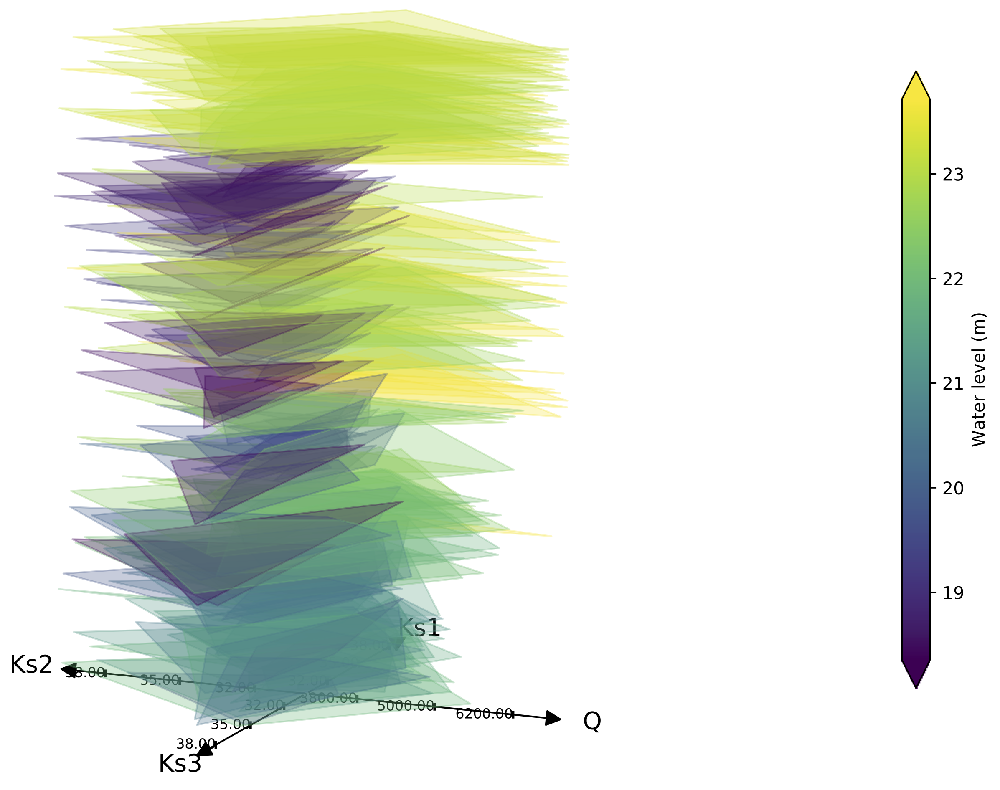
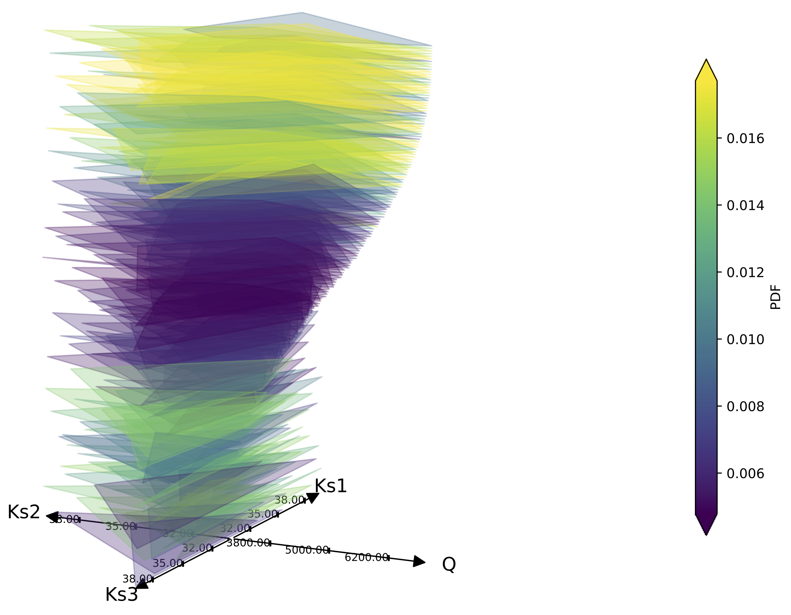

.. image:: https://circleci.com/gh/tupui/3D-Kiviat.svg?style=svg
    :target: https://circleci.com/gh/tupui/3D-Kiviat
.. image:: https://img.shields.io/badge/python-3.6-blue.svg

3D-Kiviat
=========

What is it?
-----------

This project implements the 3D-Kiviat plot technique to visualize uncertainties [Roy2019]_.
It proposes a solution to visualize high input and output dimensions. This solution
relies on Hypothetical Outcome plot (HOPs) applied to functional response surface,
Highest Density Region metrics, and a 3-dimensional version of Kiviat plot.
For the 3D-Kiviat, each layer stands for a hypothetical outcome (a realization)
coloured by a scalar value related to the response variable. This value is either
the response variable at a given point and time or some distance computed with
the HDR metrics. This solution can be augmented with data sonification to
traduce the HDR metrics (see `HDR-Boxplot <https://github.com/tupui/HDR-Boxplot>`_).

.. code-block:: python
    
    sample = np.loadtxt('data/sample_mascaret.dat')
    data = np.loadtxt('data/data_mascaret.dat')

    kiviat = Kiviat3D(sample, data)
    kiviat.plot()

The output is the following figure: 

.. note:: The package can easily be used in any framework as long as there
  is a dependency between input and outputs.

How does it work?
-----------------

It consists to adapt the 3D-Kiviat plot to the visualization of both input and
response variable spaces. Each plane of the Kiviat represents a realization
within the dataset with as many directions as the input dimensions.

The input variables here correspond to the friction coefficients
(*Ks1*, *Ks2*, *Ks3*) and the constant inflow *Q*; the output variable is the
water level at the city Marmande, it is colour-coded onto the Kiviat plane. For the
3D-Kiviat, planes are stacked into a 3D object with respect to the response
variable (scalar or functional) related value that is colour-coded. It should
be noted that each plane is filled with only one colour to preserve readability.
The benefit of 3D-Kiviat stands in the choice of both the stacking and the
colouring strategies.

When representing functional output data, different stacking and colouring
strategies allow to highlight different information in the dataset. Four choices
of stacking and colouring are illustrated here after; the stacking and colouring
choices are indicated in the legend, they are achieved with respect to the
response variable at a given location and time, with respect to the HDR metric
or with respect to one of the input variables. 

Here, stacking is done with respect to the response variable at a given location
and time while the colouring is done with respect to the difference to the median
realization computed with the HDR metric. This allows to get a sense of the spatial
PDF augmented with the input parameter mapping.

Another possibility consists in stacking with respect to the HDR metric and
colouring with respect to the response variable value.

Here, stacking is done with respect to one of the input variable (in the present
case *Q*) and the colouring is done with respect to the HDR metrics.

Finally, this figure displays both stacking and colouring with respect to the
response variable value.

From the first, third and fourth figures, the impact of *Q* on the water level
is easily readable; water level increases with *Q*. High water level values are
also obtained for low *Ks3* values while other parameters seem to have no
significant impact on the response variable. *Ks1* and *Ks2* have barely any
impact on the response variable. The manipulation of the animated 3D-Kiviat is
even more adapted to data analysis. The coloured HDR in first and third figures
indicates how each realization differs from the median realization. It appears
that stacking for colouring with respect to response variable or HDR serves
different purposes. Ordering by response variable allows to discriminate which
input lead to specific response variable value while ordering by HDR illustrated
the dispersion of the dataset with respect to a reference realization. Sounding
is a supplementary way to emphasis the information, especially for large datasets.

Requirements
------------

The dependencies are: 

- Python >= 2.7 or >= 3.5
- `scikit-learn <http://scikit-learn.org>`_ >= 0.18
- `numpy <http://www.numpy.org>`_ >= 0.13
- `scipy <http://scipy.org>`_ >= 0.15
- `matplotlib <https://matplotlib.org>`_ >= 2.1

References
----------

.. [Roy2019] Sounding Spider: An Efficient Way for Representing Uncertainties
  in High Dimensions. Pamphile T. Roy, S. Ricci, J.C. Jouhaud, B. Cuenot. 2019
